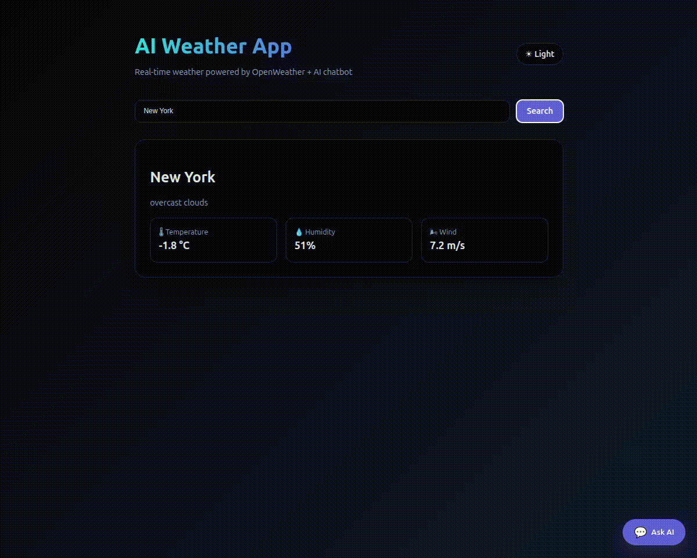

  
  
  
  

<h1 align="center">🤖 React MCP Chatbot</h1>

  <strong>AI-powered React chatbot with intelligent API tool calling</strong>

  A production-ready chat widget that understands user intent, selects the correct API,
  executes it, and responds with clean Markdown-formatted answers.

<h2>✨ What is React MCP Chatbot?</h2>

  <strong>React MCP Chatbot</strong> is a customizable AI chatbot component that connects
  <strong>natural language user requests</strong> to <strong>real API calls</strong>
  using an LLM-powered agent.

  Instead of writing complex conditional logic, you simply define
  <strong>tools (API functions)</strong> —
  the AI automatically decides <strong>when and how</strong> to call them.

  This makes it ideal for <strong>real-world, data-driven AI applications</strong>.

<h2>🎥 Demo</h2>

  Example: user asks a question → AI decides → API is called → formatted response

  

<h2>🚀 Features</h2>

<ul>
  <li>🤖 AI-driven tool selection</li>
  <li>🔌 Pluggable API tools</li>
  <li>🧠 LLM-powered intent detection</li>
  <li>🧩 Fully typed (TypeScript)</li>
  <li>🎨 Modern floating chat UI</li>
  <li>🌗 Dark & Light themes</li>
  <li>📐 Highly customizable</li>
  <li>📝 Markdown responses (tables, lists, code)</li>
  <li>⚡ Ollama / Groq / OpenAI</li>
  <li>🛠 Optional & validated tool parameters</li>
</ul>

<h2>🧠 How It Works</h2>

<pre><code>
User Message
     ↓
LLM analyzes intent
     ↓
Tool decision (or no tool)
     ↓
API function executed
     ↓
Markdown-formatted response
</code></pre>

<h2>📦 Installation</h2>

<pre><code>npm install react-mcp-chatbot</code></pre>

or

<pre><code>yarn add react-mcp-chatbot</code></pre>

<h2>⚡ Quick Start</h2>

<pre><code>import { MCPAgent } from "react-mcp-chatbot";

&lt;MCPAgent
  provider="ollama" // or "groq"
  providerURL="http://localhost:11434"
  model="llama3"
  tools={tools}
/&gt;
</code></pre>

<h2>🛠 Defining API Tools</h2>

<pre><code>import type { MCPTool } from "react-mcp-chatbot";

const weatherTool: MCPTool = {
  name: "get_weather",
  description: "Get current weather for a city",
  parameters: {
    city: {
      type: "string",
      description: "City name",
    },
    units: {
      type: "string",
      optional: true,
      description: "metric or imperial",
    },
  },
  call: async ({ city, units }) =&gt; {
    const res = await fetch(
      `https://api.example.com/weather?q=${city}&units=${units ?? "metric"}`
    );
    return res.json();
  },
};
</code></pre>

<h2>🎨 UI Customization</h2>

<pre><code>&lt;MCPAgent
  title="Support Assistant"
  align="right"
  theme="dark"
  width={420}
  height={640}
  primaryColor="#6366f1"
  borderRadius={20}
  placeholder="Ask me anything…"
/&gt;
</code></pre>

<h2>🧭 Use Cases</h2>

<ul>
  <li>AI customer support bots</li>
  <li>Internal admin dashboards</li>
  <li>API copilots</li>
  <li>SaaS onboarding assistants</li>
  <li>Analytics chatbots</li>
  <li>Developer tools</li>
  <li>Portfolio projects</li>
</ul>

<h2>📜 License</h2>

  MIT © <a href="https://github.com/TigranZakharyan">Tigran Zakharyan</a>

<h2>⭐ Star the Project</h2>

  If this project helped you or inspired you, please consider giving it a star ⭐ 
  It helps a lot and motivates further development.

